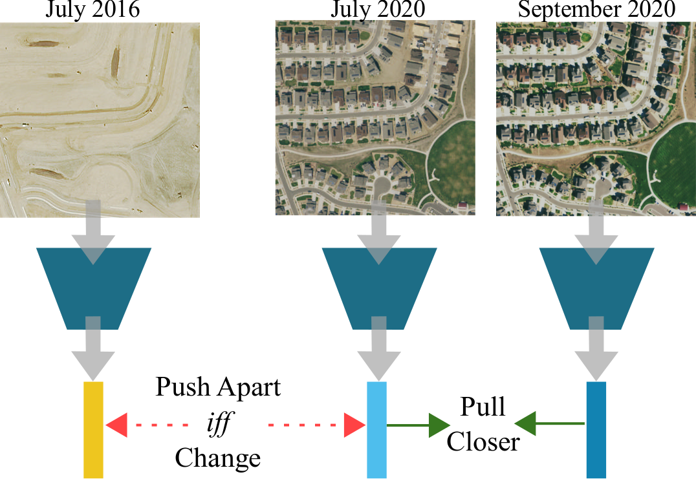

# Change-Aware Sampling and Contrastive Learning for Satellite Images
This is the implementation for [CVPR 2023](https://cvpr2023.thecvf.com/) paper [Change-Aware Sampling and Contrastive Learning for Satellite Images](https://research.cs.cornell.edu/caco).

Authors: [Utkarsh Mall](https://www.cs.cornell.edu/~utkarshm/), [Bharath Hariharan](http://home.bharathh.info/), [Kavita Bala](https://www.cs.cornell.edu/~kb/)

## Installation
This codebase is built with and tested with python3.9, and torch 1.7.1. We highly recommend creating environment using anaconda.

> conda create --name cacoenv python=3.9.13 -y
After activating the environment:

> conda activate cacoenv

Install the following packages:

>conda install cudatoolkit=11.0 -y

>pip install torch==1.7.1+cu110 torchvision==0.8.2+cu110 -f https://download.pytorch.org/whl/torch_stable.html

>pip install matplotlib pytorch-lightning==1.1.8 pytorch-lightning-bolts==0.3.0 scikit-learn rasterio lmdb pandas 

>pip installjupyter progressbar opencv-python 

Optionally also install

>pip install wandb  gym

If running into error due to some library mismatch, please refer to `requirements.txt` for the correct versions.

## Quick inference
Use the notebook for quick inference of on our pretrained model. 

> cd notebooks
> python -m jupyter notebook --ip 0.0.0.0 --no-browser

The notebook also provides instructions on how to download pretrained models.

The pretrained models can be found at [this link](https://research.cs.cornell.edu/caco/checkpoints/)

## Training
In order to retrain the model, we need to download the CACo data and then run training.
A sample training procedure is provided in  `sample_training.sh`

> bash sample_training.sh

The data can be found at [this link](https://research.cs.cornell.edu/caco/data/caco/)
Refer to the `sample_training.sh` for downloading and placing data.

To train a `resnet-18` model with `10k data` and `caco` loss run the following
> python3 main_pretrain.py --data_dir ../data/clean_10k_geography/ --base_encoder resnet18 --batch_size 256 --data_mode caco --max_epochs 1000 --schedule 600 800 -d gereric_description

## A few more things will be released soon.
- [ ] Code to download custom dataset using CACo sampling.
- [ ] Setup for evaluating on other datasets, BigEarthNet, DynmamicEarthNet, OSCD, and Change Events. 
- [x] [1m training set](https://zenodo.org/records/10913174). 

## Acknowledgements
This repository follows the stucture from [SeCo](https://github.com/ServiceNow/seasonal-contrast) and uses same versions of libraries used.

